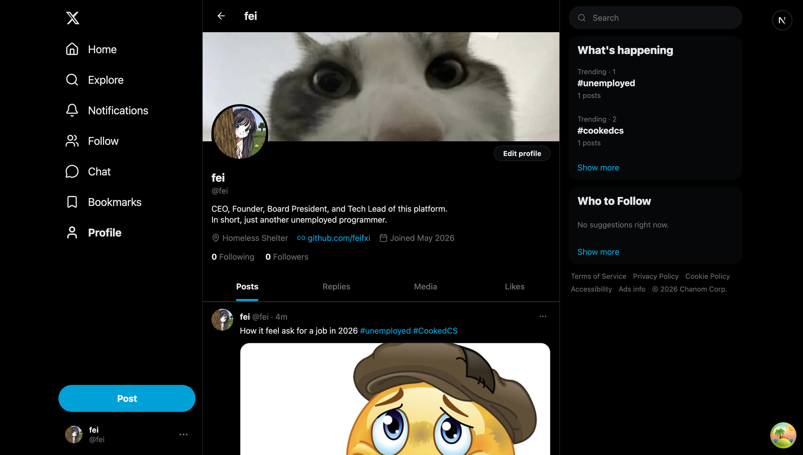

# Twitter Microservices

Cloud-native microservices Twitter clone — learning project for distributed systems, event-driven architecture, and SRE practice.



## Distributed Systems Concepts

What this project demonstrates end-to-end. Implementation detail in [docs/ARCHITECTURE.md](docs/ARCHITECTURE.md).

**Data integrity**
- **Transactional outbox** — Kafka publish committed in the same DB transaction as the row that caused it; no dual-write window.
- **At-least-once + consumer idempotency** via `ON CONFLICT DO NOTHING` and per-event dedup tables.
- **Single-writer rule** — `tweet-service` is the sole writer of `user:snapshot:*` in Redis.
- **Schema-per-service** on a shared Postgres cluster; no cross-service DB access.

**Read-side scalability**
- **Hybrid fan-out** — push to followers on write for regular authors, pull-on-read merge for celebrity authors (≥1K followers).
- **Denormalised Redis snapshots** — `tweet:snapshot` / `user:snapshot` / `tweet:counts` collapse N joins into one pipelined `HGETALL` on the feed read path.
- **Cursor pagination** with ULID-sortable IDs — O(1) index seek regardless of page depth.
- **Sliding-window aggregation** — trending is `ZUNIONSTORE` over the last 60 minute buckets, auto-decaying via TTL.
- **CQRS split** — `tweet-service` writes (Postgres source of truth), `feed-service` reads (Redis-only path).

**Inter-service communication**
- **gRPC internally, REST through Kong externally.** Internal calls have stronger contracts; external clients get a single auth boundary.
- **Circuit breakers** (gobreaker) + **retry with backoff + jitter** wrapping every cross-service gRPC client; retry sits inside the breaker so the breaker observes the final outcome.
- **Dead-letter queues** per consumer group with provenance headers for replay.
- **Bounded concurrency** — 100-slot semaphore caps inflight fan-out goroutines on a burst.

**Resilience**
- **Graceful degradation everywhere** — Redis miss → empty author fields, gRPC failure → `is_liked=false`, OpenAI down → keyword-fallback search. Never 5xx the user just because a dep blipped.
- **`/healthz` (dep-aware readiness, returns 503 when a backing store is unreachable)** vs **`/livez` (always-200 liveness)** — load balancer pulls the pod out of rotation but k8s doesn't restart it.

**Real-time push**
- **SSE + Redis Pub/Sub** — every notification-service pod fans out via Pub/Sub, each pod forwards to its local SSE subscribers, no sticky sessions required.

**Observability spine**
- **W3C `traceparent`** propagated through HTTP, gRPC, **and Kafka message headers** — one trace per user action across every hop.

## Stack

| Component | Local Dev | Production (AWS) |
|-----------|-----------|-----------------|
| Language / framework | Go 1.26 · Gin · sqlc | *(same)* |
| Frontend | Next.js 16 | *(same)* |
| API Gateway | Kong | *(same)* |
| Auth | Keycloak | *(same)* |
| Database | PostgreSQL | Aurora PostgreSQL Serverless v2 |
| Cache | Redis | ElastiCache |
| Message broker | Redpanda | Amazon MSK (Kafka) |
| Search | OpenSearch | Amazon OpenSearch Service |
| Object storage | LocalStack (S3) | Amazon S3 |
| Orchestration | Docker Compose | Amazon EKS · Terraform |
| Observability | slog · Prometheus · OpenTelemetry → Jaeger | slog · CloudWatch · OpenTelemetry → X-Ray |

## Services

| Service | Local HTTP | gRPC | Responsibility |
|---|---|---|---|
| user-service | 8001 | 9001 | Profile, follow graph, Keycloak provisioning |
| tweet-service | 8002 | 9002 | Tweets, likes, retweets, replies, `user:snapshot` writer |
| feed-service | 8003 | — | Fan-out feed, trending |
| notification-service | 8004 | — | Notifications |
| media-service | 8005 | — | S3 presigned uploads |
| search-service | 8006 | — | OpenSearch tweet + user search |
| web (Next.js) | 3000 | — | Frontend |

All traffic in prod goes through **Kong on :8000**. Internal ports above are local-dev only.

## Prerequisites

Docker Desktop · Go 1.26+ · Node.js 22+ · Make · `jq`.

## Quick Start

```bash
cp .env.example .env          # fill in OPENAI_API_KEY and Google OAuth creds
make dev                      # build + run everything
make healthcheck              # verify all services healthy
make run-web                  # start Next.js (optional)
```

Open [http://localhost:3000/login](http://localhost:3000/login).

`make dev-stop` tears everything down.

## Make Targets

```
make dev               # build + run full stack
make dev-infra         # only backing stores (Postgres, Redis, Kafka, S3, OpenSearch, Keycloak, Kong)
make run-<service>     # run one Go service against dev-infra
make run-web           # Next.js dev server
make test              # unit tests
make test-integration  # integration tests (needs Docker)
make test-e2e          # Playwright E2E (needs make dev + make run-web)
make generate-sqlc     # regen sqlc after editing db/query.sql
make generate-proto    # regen protobuf after editing .proto
make generate-realm    # render Keycloak realm from .env (auto-runs before dev)
make lint              # go vet all services + biome on frontend
make healthcheck       # curl all /healthz endpoints
```

## Local URLs

| Resource | URL |
|---|---|
| Kong gateway | http://localhost:8000 |
| Keycloak (admin / admin) | http://localhost:8080 |
| Redpanda Console | http://localhost:8089 |
| Jaeger | http://localhost:16686 |
| Prometheus | http://localhost:9090 |
| OpenSearch | http://localhost:9200 |
| LocalStack S3 | http://localhost:4566 |

## Deploy to AWS

```bash
make stage-bootstrap   # one-time: S3 state + DDB lock + GitHub OIDC + $50 budget
make ecr-push          # build + push 8 images to ECR
make stage-up          # provision EKS, data plane, apps; ~30 min wall-clock
```

Operational runbook: [docs/DEPLOY.md](docs/DEPLOY.md). `make stage-down`
tears the env down to ~$0 between sessions; bootstrap stack survives so
state is preserved.

CI/CD via GitHub Actions: `ci.yml` (Go matrix + Next.js), `infra.yml`
(terraform plan/apply), `deploy.yml` (ECR build + EKS rollout). All AWS
auth via OIDC, no stored keys.

## Docs

- [docs/ARCHITECTURE.md](docs/ARCHITECTURE.md) — service layout, data models, Kafka contracts, Redis schema, conventions
- [docs/DEPLOY.md](docs/DEPLOY.md) — AWS stage env runbook (bootstrap → up → down)
- [docs/CHAOS.md](docs/CHAOS.md) — chaos exercise procedures
- [docs/PHASES.md](docs/PHASES.md) — phase-by-phase build history

## Troubleshooting

- **`make dev` fails: docker daemon not running** — start Docker Desktop.
- **Port in use** — `make dev-stop` first.
- **Healthcheck fails after start** — wait 30s for backing stores; Keycloak is the slowest (~30s).
- **Keycloak "Could not send authentication request"** — your `.env` has empty Google creds. Fill in `GOOGLE_CLIENT_ID` / `GOOGLE_CLIENT_SECRET`, then `make generate-realm && docker compose restart keycloak`.
- **Search returns 502** — `OPENAI_API_KEY` unset or invalid. Search-service `MustEnv`s on startup.
